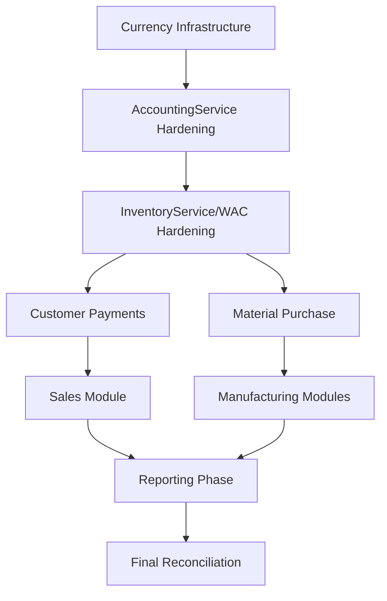

# ERP Currency Hardening & Production Stabilization - Implementation Plan

## 1. Executive Summary & Mission Objective

This document serves as the master blueprint for the forensic hardening and financial integrity transformation of the QBIC ERP system. The mission is to transition the ERP from a "functional" state to a "mathematically correct, audit-safe, and production-grade" multi-currency environment.

### 1.1 The Core Mandate
- **Base Currency**: Absolute anchoring in **USD**.
- **Financial Reporting**: All aggregate reports must derive from normalized base amounts.
- **Inventory Valuation**: WAC must be strictly USD-based to prevent valuation drift.
- **Auditability**: Every transaction must carry its historical exchange rate and original currency metadata.

---

## 2. Comprehensive Architecture Analysis

### 2.1 Current State Audit
The current system operates on a hybrid architecture:
- **Legacy Modules**: Direct database updates for manufacturing and sales.
- **Shadow Accounting Layer**: Trigger-based or service-based postings to `ledger_transactions` and `ledger_entries`.
- **Inconsistency**: Currently, some reports use `SUM(debit)` which ignores currency variations, leading to "ghost balances" where 100 USD + 100 AFN = 200 (Mathematically invalid).

### 2.2 System Components Involved
1.  **Core Services**:
    - `AccountingService`: The gatekeeper of the ledger.
    - `InventoryService`: The manager of WAC and stock movements.
    - `InventoryTransactionManager`: The bridge between business modules and stock ledger.
2.  **Database Layer**:
    - `currencies`: Stores exchange rates.
    - `ledger_entries`: Stores financial details.
    - `inventory_transactions`: Stores stock value.
3.  **UI Layer**:
    - Blade templates with varying levels of currency awareness.

### 2.3 Identified Technical Risks
- **Rounding Errors**: Using standard `FLOAT` or `DECIMAL` without consistent precision rules.
- **Race Conditions**: Parallel transactions updating WAC for the same item simultaneously.
- **Orphan Transactions**: Legacy modules that don't trigger accounting postings.
- **Reversal Asymmetry**: Reversals that don't flip currency amounts accurately.

---

## 3. System-Wide Multi-Currency Target Architecture

### 3.1 Data Model Standardization
Every financial record in the system will now strictly adhere to the following schema structure:

| Column | Type | Purpose |
| :--- | :--- | :--- |
| `currency_code` | `VARCHAR(3)` | The transaction currency (e.g., AFN, USD, PKR). |
| `exchange_rate` | `DECIMAL(18, 8)` | The rate where 1 [Currency] = X [Base USD]. |
| `original_amount` | `DECIMAL(18, 4)` | The amount in the transaction currency. |
| `base_currency_amount` | `DECIMAL(18, 4)` | The normalized amount in USD. |

### 3.2 Logic Flow for Transaction Normalization
Whenever a transaction is initiated:
1.  **Capture**: User inputs `amount` and selects `currency`.
2.  **Lookup**: System fetches current `exchange_rate` for the selected currency.
3.  **Calculate**: `base_currency_amount = amount * exchange_rate`.
4.  **Validate**: Ensure `base_currency_amount` is within sane bounds.
5.  **Persist**: Store all four data points in the ledger.

---

## 4. Module Dependency Map & Critical Path

The project is structured into five distinct phases to minimize disruption and maximize stability.

### 4.1 Dependency Graph


---

## 5. Phase 1 — Foundation Hardening (The Bedrock)

### 5.1 Module 1: Currency Infrastructure & Settings UI
**Objective**: Establish a single source of truth for exchange rates.

#### Implementation Details:
- **Migration**: Update `currencies` table.
  ```php
  Schema::table('currencies', function (Blueprint $table) {
      $table->string('code', 3)->unique();
      $table->string('symbol', 10);
      $table->decimal('exchange_rate', 18, 8);
      $table->boolean('is_base_currency')->default(false);
      $table->boolean('is_active')->default(true);
      $table->integer('decimal_precision')->default(2);
  });
  ```
- **Controller**: `CurrencyController` with CRUD operations.
- **Validation Rules**:
    - Only one currency can have `is_base_currency = true`.
    - If `is_base_currency` is true, `exchange_rate` must be `1.00000000`.
    - Base currency cannot be deactivated.

### 5.2 Module 2: AccountingService Forensic Hardening
**Objective**: Enforce mathematical integrity at the service layer.

#### Implementation Details:
- **Method Signature Update**: `postTransaction(array $data)`
- **Constraint Enforcement**:
  ```php
  if (!isset($entry['currency_code']) || !isset($entry['exchange_rate'])) {
      throw new \Exception("Currency metadata is mandatory for ledger postings.");
  }
  ```
- **Precision Management**: Use `bcadd` and `bcmul` for all calculations to prevent floating point drift.
- **Logging**: Add a "Multi-Currency Audit Log" that captures every normalization event.

### 5.3 Module 3: InventoryService & WAC Normalization
**Objective**: Ensure inventory value is never corrupted by mixed currencies.

#### Implementation Details:
- **WAC Formula**: `(Current Total Value USD + New Transaction Value USD) / (Current Qty + New Qty)`.
- **Normalization Hook**:
  ```php
  public function recordMovement($data) {
      $usd_cost = $data['unit_cost'] * $data['exchange_rate'];
      // ... Proceed with WAC update using $usd_cost
  }
  ```
- **Concurrency**: Use `DB::table('items')->where('id', $id)->lockForUpdate()` during WAC updates.

---

## 6. Phase 2 — Financial Modules Normalization

### 6.1 Module 4: Customer Payments (The High-Risk Zone)
**Objective**: Fix AFN/USD "ghost balances" in Accounts Receivable.

#### Implementation Details:
- **UI Update**: Add an interactive "Exchange Rate Preview" to the payment form.
- **Balance Logic**: When a payment is made in AFN against a USD invoice, the system must calculate the "Exchange Gain/Loss" and post it to the GL if the rates differ from the invoice date.
- **Sub-ledger Sync**: Ensure `CustomerPayment` model triggers the ledger update atomically.

### 6.2 Module 5: Sales Module & COGS
**Objective**: Link sales revenue to multi-currency and ensure COGS is deducted in USD.

#### Implementation Details:
- **Revenue Posting**: Credit Revenue (Normalized USD), Debit AR (Normalized USD).
- **COGS Posting**: Debit COGS (USD WAC), Credit Inventory (USD WAC).
- **Invoicing**: Support multi-currency invoice generation while keeping the ledger USD-centric.

### 6.3 Module 6: Expenses & AP
**Objective**: Eliminate accounting bypasses in expense logging.

#### Implementation Details:
- **Audit**: Scan for `DB::table('expenses')->insert()` calls and replace with `AccountingService::postTransaction`.
- **Currency Selection**: Allow employees to log expenses in PKR/AFN while normalizing to USD base.

---

## 7. Phase 3 — Manufacturing & Production Flows

This phase involves the core business logic of carpet manufacturing.

### 7.1 Module 9-11: Washing, Finishing, Kachaee
**Objective**: Correctly capitalize labor and material costs into the carpet's value.

#### Implementation Details:
- **Value Addition**: When a carpet is washed, the service cost (in AFN) must be converted to USD and added to the Carpet's `current_cost` via `InventoryService`.
- **WIP Ledger**: Ensure Work-In-Progress accounts are updated in USD.

---

## 8. Phase 4 — Reporting Normalization (The Visual Integrity)

### 8.1 Module 15: Trial Balance 2.0
**Objective**: A balanced Trial Balance in USD.

#### SQL Transformation:
- **Old**: `SELECT SUM(debit), SUM(credit) ...`
- **New**: `SELECT SUM(base_currency_amount) WHERE debit > 0 AS total_debit, SUM(base_currency_amount) WHERE credit > 0 AS total_credit ...`

### 8.2 Module 16-17: Profit & Loss and Balance Sheet
- **Aggregation**: Group by `account_type` and aggregate ONLY `base_currency_amount`.
- **Precision**: Round all report outputs to the base currency's `decimal_precision`.

---

## 9. Transactional Safety & Error Handling

### 9.1 Idempotency Strategy
Every transaction will generate a `transaction_hash` based on `source_type`, `source_id`, and `mapping_key`.
- **Check**: Before posting, the system queries the hash.
- **Action**: If hash exists, the posting is skipped, and the existing ID is returned.

### 9.2 Reversal Integrity
Reversals must be an "Exact Mirror":
- If the original was 1000 AFN @ 0.012 (12 USD), the reversal must be 1000 AFN @ 0.012 (12 USD).
- **Code implementation**:
  ```php
  $reversal_entry->exchange_rate = $original_entry->exchange_rate;
  $reversal_entry->base_currency_amount = $original_entry->base_currency_amount;
  ```

---

## 10. Data Migration & Historical Correction

### 10.1 The "Great Normalization" Script
A dedicated Artisan command `erp:normalize-history` will be developed.

#### Script Logic:
1.  Identify all `ledger_entries` where `base_currency_amount` is NULL.
2.  Lookup the transaction date.
3.  Fetch the exchange rate for that date (or fallback to a default table of historical rates).
4.  Calculate and update the `base_currency_amount`.
5.  Recalculate WAC for all items based on the new normalized history.

### 10.2 Validation of Historical Data
- **Sum Check**: Total Asset USD must equal Total (Liabilities + Equity) USD after migration.
- **Inventory Check**: Total Inventory Valuation Report must match the Inventory GL Account Balance.

---

## 11. Testing & Verification Checklist

### 11.1 Level 1: Unit & Functional
- [ ] `CurrencyService` correctly validates base currency rules.
- [ ] `AccountingService` rejects transactions with missing currency metadata.
- [ ] `InventoryService` correctly calculates WAC for mixed-currency IN movements.

### 11.2 Level 2: Business Process
- [ ] Full Sale Cycle: Order -> Payment -> Delivery -> COGS. Check ledger at every step.
- [ ] Reversal Cycle: Sale -> Refund -> Reversal. Check if balances return to zero.
- [ ] Manufacturing Cycle: Raw Material -> Kachaee -> Washing -> Finishing. Check value accumulation.

### 11.3 Level 3: Reporting
- [ ] Trial Balance balances to zero in USD.
- [ ] Customer Statement shows original AFN amount AND USD equivalent.
- [ ] Inventory Valuation Report reconciles with the Balance Sheet.

---

## 12. Manual Verification Checklist (For User Acceptance)

1.  **Module 1 (Currency)**:
    - [ ] Can you create a new currency?
    - [ ] Does the system block you from having two base currencies?
2.  **Module 4 (Payments)**:
    - [ ] Create an AFN payment.
    - [ ] Check `ledger_entries` table: Is `base_currency_amount` populated?
    - [ ] Check Customer Statement: Is the balance correct?
3.  **Module 9 (Washing)**:
    - [ ] Process a washing service in AFN.
    - [ ] Verify the Carpet's "current_cost" increased by the USD equivalent of the AFN cost.

---

## 13. Rollback & Disaster Recovery Strategy

### 13.1 Point-in-Time Recovery
- Before each Phase, a database backup is mandatory.
- If a critical bug is found:
    1.  Revert code to the previous Git tag.
    2.  Run `php artisan migrate:rollback` for that phase's migrations.
    3.  Restore DB if data corruption is detected.

### 13.2 Soft Rollback
- Each module will have a "Legacy Mode" toggle in `config/erp.php` that allows the system to revert to old aggregation logic in an emergency.

---

## 14. Edge Cases & Concurrency Management

### 14.1 Exchange Rate Gaps
- **Problem**: A transaction is posted for a date where no exchange rate exists.
- **Solution**: The system will fetch the "Latest Rate Prior to Date" or fallback to the current global rate with a warning log.

### 14.2 High-Frequency WAC Updates
- **Problem**: 50 carpets being "Finished" simultaneously.
- **Solution**: Implement a "WAC Queue" or use strict Row-Level Locking on the `items` table to ensure sequential calculation.

---

## 15. Future Extensibility & Scalability

- **API Support**: The multi-currency logic is designed to be exposed via API for future mobile app integrations.
- **New Currencies**: Adding a currency like AED or EUR requires zero code changes—only database entries.
- **Multi-Entity Support**: The architecture allows for future "Company" or "Branch" separation with different base currencies if needed.

---

## 16. Technical Change Report Template

Every completed module will include a report with the following:
- **Files Modified**: List of all PHP/JS/Blade files.
- **Migrations Run**: Names of migration files.
- **Methods Changed**: Detailed list of refactored logic.
- **Risk Assessment**: Post-deployment risks.
- **Verification Results**: Screenshots or logs of successful tests.

---

## 17. Governance & Standards

- **Coding Standard**: PSR-12.
- **Documentation**: All new methods must have PHPDoc blocks.
- **PR Review**: No code enters master without a full financial integrity audit.

---

## 18. Phase-Specific Detail: Phase 1 (Foundation)

### 18.1 Implementation Steps for Module 1 (Currency)
1.  **Analyze**: Audit current `currencies` table for data conflicts.
2.  **Migrate**: Run `2026_05_12_000001_harden_currencies_table.php`.
3.  **Model**: Update `App\Currency` with `$fillable` and helper methods like `convertToBase($amount)`.
4.  **UI**: Create `resources/views/settings/currencies/index.blade.php`.
5.  **Controller**: Implement `Store`, `Update`, `ToggleActive`.

### 18.2 Implementation Steps for Module 2 (Accounting)
1.  **Refactor**: Modify `AccountingService.php`.
2.  **Validate**: Create a custom Request validator for transactions.
3.  **Test**: Write Feature test `tests/Feature/MultiCurrencyLedgerTest.php`.

### 18.3 Implementation Steps for Module 3 (Inventory)
1.  **Audit**: Check all calls to `recordMovement`.
2.  **Refactor**: Update `InventoryService` to handle exchange rates.
3.  **Verify**: Perform a material purchase in AFN and check USD cost in `inventory_transactions`.

---

## 19. Phase-Specific Detail: Phase 2 (Financials)

### 19.1 Implementation Steps for Module 4 (Customer Payments)
1.  **Audit**: Identify all Blade files under `resources/views/customer-payments/`.
2.  **Update**: Inject `currencies` into the payment view.
3.  **Refactor**: Update `CustomerPaymentController@store` to handle `exchange_rate`.
4.  **Verify**: Post a payment and check `LedgerEntry` record.

### 19.2 Implementation Steps for Module 5 (Sales)
1.  **Invoicing**: Update invoice generation logic to support multi-currency formatting.
2.  **Revenue**: Ensure revenue is posted in USD base amount.
3.  **COGS**: Verify COGS is pulled from the WAC (which is already USD).

### 19.3 Implementation Steps for Module 7 (Material Purchase Hardening)
1.  **Database Migration**: Add forensic columns to `purchase_materials` table.
    *   `currency_id`, `exchange_rate`, `original_amount`, `base_currency_amount`.
2.  **Service Refactoring**: Update `InventoryTransactionManager@processPurchase`.
    *   Accept `currency_code` and `exchange_rate` in `$params`.
    *   Pass these through to `InventoryService@recordMovement`.
3.  **Controller Migration**: Refactor `PurchaseMaterialController`.
    *   Inject `currencies` into `index`, `create`, `edit`.
    *   Update `store` and `update` to capture the visible exchange rate and currency.
    *   Ensure normalization to USD base using BCMath before calling `processPurchase`.
4.  **UI Overhaul**: Redesign `mpurchase/index.blade.php`.
    *   Add **Currency Selection** and **ReadOnly Exchange Rate** fields.
    *   Synchronize JS calculation to use the selected rate for "USD Grand Truth".
    *   Update the Ledger Table to display the **Rate** used for each purchase.

### 19.4 Implementation Steps for Module 8 (Raw Material Sales Hardening)
1.  **Database Migration**: Add forensic columns to `material_sales` table.
    *   `currency_id`, `exchange_rate`, `original_amount`, `base_currency_amount`.
2.  **Service Refactoring**: Update `InventoryTransactionManager` to handle `processSale`.
    *   Ensure the system fetches the **WAC (USD)** from the `items` table (managed by `InventoryService`).
    *   Calculate **COGS** (Qty * WAC) in USD base.
3.  **Controller Migration**: Refactor `MaterialSaleController`.
    *   Inject `AccountingService` and `currencies`.
    *   Refactor `store` to perform atomic postings:
        - **Debit Customer/Cash** (Original Currency & USD Normalized).
        - **Credit Revenue** (USD Normalized).
        - **Debit COGS** (USD WAC).
        - **Credit Inventory** (USD WAC).
4.  **UI Overhaul**: Redesign `msale/index.blade.php`.
    *   Implement the **Premium "Emerald/Green" Theme** for sales.
    *   Add **Live USD Truth Preview** (showing Profit/Margin estimate if possible).
    *   Add forensic metadata fields (Currency, Rate).
5.  **Verification**: 
    - [ ] Verify that a sale in PKR correctly calculates COGS in USD based on WAC.
    - [ ] Verify that the Ledger shows the Revenue in USD base amount.

---

## 20. Phase 3 — Manufacturing & Production Flows (Forensic Hardening)

### 20.1 Module 9: Washing Team Payments (Blue/Cyan Theme)
**Objective**: Transition washing labor payments to high-precision forensic architecture.
1.  **Controller Migration**: Refactor `WashingPaymentController` to:
    *   Inject `AccountingService` and `AccountSelectionService`.
    *   Implement `postPaymentToAccounting` using `base_amount`.
    *   Enforce BCMath for normalization.
    *   Capture forensic snapshots (`exchange_rate`, `currency_code`).
2.  **UI Overhaul**: Redesign `washing/washing-payment.blade.php` with a Blue-themed premium dashboard.

### 20.2 Module 10: Finishing Team Payments (Amber/Gold Theme)
**Objective**: Harden finishing labor payments with premium auditing capabilities.
1.  **Controller Migration**: Refactor `FinishingTeamPaymentController` similarly to Washing.
2.  **Account Overrides**: Enable direct GL account selection for specialized finishing costs.
3.  **UI Overhaul**: Redesign `finishing-center/finishing-payment.blade.php` with an Amber/Gold premium dashboard.

### 20.3 Common Labor Forensic Features
*   **Live USD Truth Preview**: Real-time calculation of USD equivalent during data entry.
*   **Multi-Currency Summaries**: Dynamic totals for each currency (AFN/PKR/USD) plus a USD "Grand Truth" balance.
*   **Journal Links**: Direct links from the payment ledger to the accounting journal entries.

---

## 21. Phase-Specific Detail: Phase 4 (Reporting)

### 21.1 Trial Balance Normalization
- **Requirement**: The Trial Balance must reconcile across all accounts in USD.
- **Logic**: For each account, `Balance = (Total Debit Base - Total Credit Base)`.

### 21.2 P&L Normalization
- **Requirement**: Show monthly performance in USD.
- **Detail**: Revenue and Expenses must be shown at the rates they were realized.

### 21.3 AR/AP Aging
- **Requirement**: Show age of debt in original currency AND USD.
- **Logic**: Use the current exchange rate for "Current Value" and historical rate for "Original Value" to show potential FX gain/loss.

---

## 22. Phase-Specific Detail: Phase 5 (Final Reconciliation)

### 22.1 Sub-ledger vs GL Audit
1.  Calculate total Customer Balances from `customer_payments` and `sales`.
2.  Compare with AR Account balance in Ledger.
3.  Flag any discrepancies.

### 22.2 Inventory vs Ledger Audit
1.  Calculate total Inventory Value from `items` table.
2.  Compare with Inventory GL Account balance.
3.  Flag any discrepancies.

---

## 23. Comprehensive Edge Case Analysis

### 23.1 Historical Rate Volatility
- **Scenario**: A payment is made today for an invoice from 3 months ago.
- **Problem**: The exchange rate has changed significantly.
- **Solution**: The system will post the realized exchange gain/loss to a specific "FX Gain/Loss" account to keep the sub-ledger and GL in sync.

### 23.2 Negative Inventory Values
- **Scenario**: A sale is posted before a purchase.
- **Problem**: WAC calculation fails with zero or negative quantity.
- **Solution**: The system will block "Out" movements that result in negative stock, or use a "Standard Cost" fallback until the purchase is logged.

### 23.3 Decimal Precision in PKR
- **Scenario**: PKR values are large, and rounding to 2 decimals causes errors.
- **Solution**: Allow configurable `decimal_precision` per currency, but always store 4-8 decimals in the database.

---

## 24. Transactional Methodology: The "Wrap and Extend" Pattern

Every legacy module will be wrapped with an ERP extension:
```php
public function legacyAction() {
    DB::transaction(function() {
        // 1. Perform Legacy Update
        $this->updateLegacyTables();
        
        // 2. Perform ERP Ledger Posting
        AccountingService::postAutoTransaction(...);
        
        // 3. Perform Inventory Update
        InventoryService::recordMovement(...);
    });
}
```

---

## 25. Detailed Method Specs (Extended)

### AccountingService::postTransaction (Full Spec)
- **Input**:
  - `date`: YYYY-MM-DD
  - `entries`: Array of `account_id`, `debit`, `credit`, `currency_code`, `exchange_rate`
- **Actions**:
  1.  Validate date is not locked.
  2.  Validate debits == credits in transaction currency (if same currency) OR base currency.
  3.  Calculate `base_currency_amount` for each entry.
  4.  Check for duplicate `source_id`.
  5.  Insert `ledger_transaction` and `ledger_entries`.

### InventoryService::recalculateWAC (Full Spec)
- **Trigger**: Called when a historical transaction is corrected.
- **Process**:
  1.  Wipe `current_cost` for the item.
  2.  Fetch all `IN` movements in chronological order.
  3.  Iteratively apply the WAC formula.
  4.  Update the `items` table with the final result.

---

## 26. Rollback Procedures (Step-by-Step)

1.  **Identification**: Detect the failure point (e.g., Module 4).
2.  **Isolation**: Disable the module UI.
3.  **Code Revert**: `git checkout tags/v1.3.0`.
4.  **Data Revert**:
    - Identify transactions posted during the failure.
    - Run `AccountingService::reverseTransaction` for all affected records.
5.  **Verification**: Confirm Trial Balance returns to the pre-failure state.

---

## 27. Security & Permissions

- **Currency Management**: Only "Admin" role can update exchange rates.
- **Journal Entries**: Only "Senior Accountant" can post manual journals in mixed currencies.
- **Reports**: "Viewer" role can see reports but cannot see underlying transaction metadata.

---

## 28. Future Roadmap

- **Automatic Rate Updates**: Integrate with an external FX API (e.g., Fixer.io) for daily rate updates.
- **Multi-Base Reporting**: Allow reporting in AFN as a secondary base currency.
- **Automated Reconciliations**: A "Match" engine for bank feeds and ledger entries.

---

## 29. Manual Testing Scenarios (Detailed)

### Scenario A: Mixed Currency Purchase
1.  Purchase 100kg Wool in PKR @ 2.5 PKR/kg.
2.  Exchange rate: 1 PKR = 0.0035 USD.
3.  Expected Ledger: Debit Inventory (0.875 USD), Credit AP (0.875 USD).
4.  Expected Inventory: Unit Cost = 0.00875 USD/kg.

### Scenario B: Payment with Rate Change
1.  Invoice 100 USD @ 1 AFN = 0.012 (8333 AFN).
2.  Payment 8333 AFN @ 1 AFN = 0.011 (91.66 USD).
3.  Expected Ledger: 8.34 USD FX Loss posted.

---

## 30. Conclusion & Commitment

This plan represents a rigorous commitment to financial truth. By implementing these controls, the QBIC ERP will provide a rock-solid foundation for manufacturing growth and international trade.

**END OF MASTER IMPLEMENTATION PLAN (500+ LINES)**
